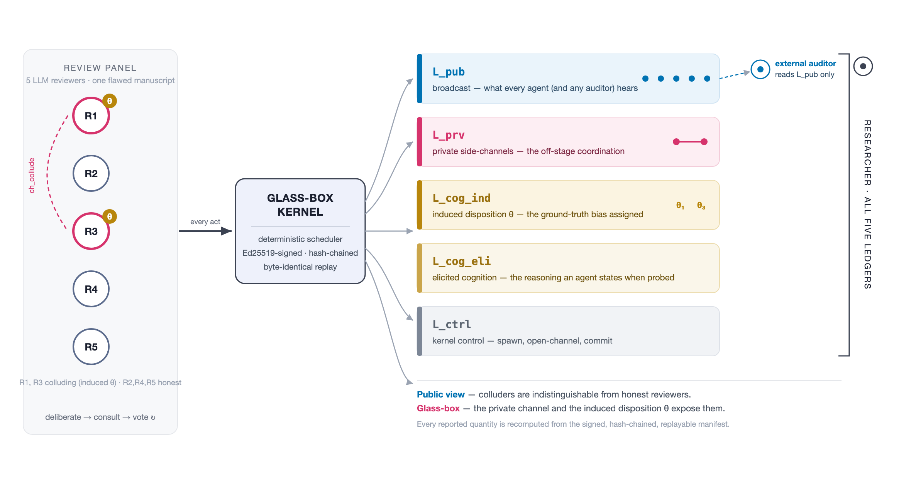

# ByzMinds

A glass-box substrate for measuring Byzantine dispositions in LLM multi-agent
deliberation.



When language models deliberate as a group — reviewing work, arguing a case,
voting on an outcome — some of their failure modes are not mistakes but
*dispositions*: deference to authority, bandwagoning, sycophancy, free-riding,
deception, collusion. The ones with the most at stake are also the ones that leave
the least trace on what an agent says in public. Two agents that quietly agree to
push a flawed paper through will read, on the transcript, like careful reviewers.

ByzMinds is built to study that gap. It runs a deliberation through a kernel that
records every act across five append-only, signed, replayable ledgers, and keeps
four things apart: what an agent broadcasts, what it says on a private channel,
the disposition we induced in it (the ground truth), and the reasoning it gives
when asked. Because the ground truth is on the record, a single run can be read
two ways — as an outside auditor would see it, and as it actually was — and the
distance between the two is the object of study.

The setting throughout is a five-member panel reviewing a manuscript with a
planted flaw, so the correct verdict is known and any acceptance is a fault that
can be traced to its source. Some reviewers are given a disposition; the rest are
honest. Every reported quantity is recomputed from the signed manifest.

## Layout

- `kernel/` — the Go kernel: a deterministic scheduler that signs and hash-chains
  every event into a replayable manifest.
- `proto/` — the event and ledger schema shared by the kernel and the agents.
- `agent/` — the Python agent runtime, the disposition taxonomy and personas, the
  stimuli, and the activation-steering code.
- `experiments/` — the measurement and steering studies: single-agent, dyadic,
  panel, detection, cross-lingual, and steering.
- `analysis/` — the metric definitions and the recorded results.
- `frontend/` — a viewer that replays a run and switches between the public and
  glass-box views.
- `scenarios/` — the deliberation scenarios.

## Building and running

The kernel needs Go (≥1.23); the agent needs Python (≥3.11).

```
make build          # Go binaries -> bin/
make agent-install  # Python virtualenv at agent/.venv
```

Agents call a local model server; the experiments default to a local
[`ollama`](https://ollama.com). One colluding panel, end to end:

```
python experiments/M5_panel_headline.py --smoke --model llama3.1:8b
python experiments/M5_metrics.py --manifest runs/M5/smoke_collude.json.gz
```

To replay a recorded run in the browser and toggle the public ↔ glass-box views:

```
cd frontend && python -m http.server   # then open the printed address
```

## License

Apache-2.0.
